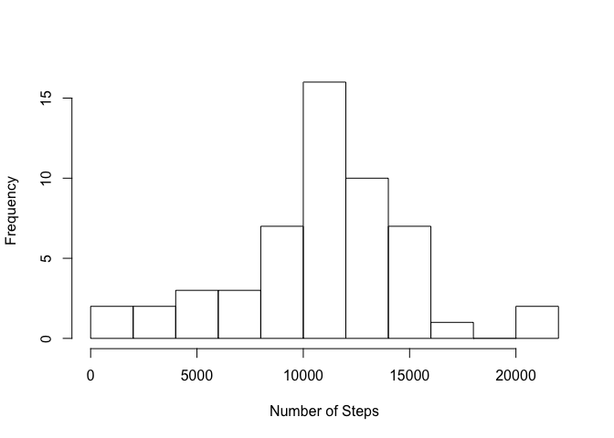
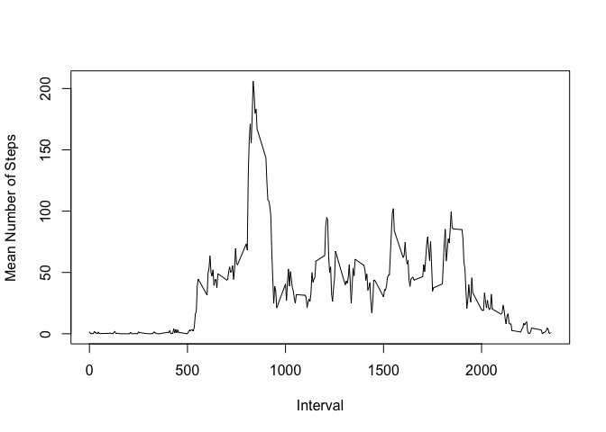
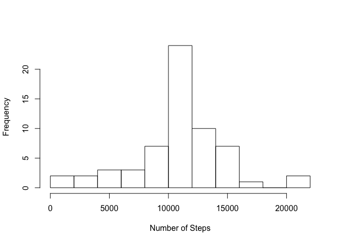
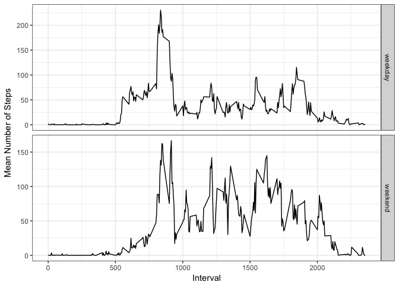

# Reproducible Research: Peer Assessment 1
Andrew M.  
8/6/2017  


In this analysis, we take a look at data from a personal activity monitoring device
with measures the number of steps taken by the wearer, in five-minute intervals over
the course of two months (October and November 2012).

The dataset is available from the [Coursera website][1] and is also included in this
repository. Variables include (per README.md):

* steps: Number of steps taking in a 5-minute interval (missing values are coded as NA)
* date: The date on which the measurement was taken in YYYY-MM-DD format
* interval: Identifier for the 5-minute interval in which measurement was taken

and a total of 17568 observations.

[1]: https://d396qusza40orc.cloudfront.net/repdata%2Fdata%2Factivity.zip

## Loading and preprocessing the data

First we load in the data for processing, converting the `date` field into a `Date`:


```r
data <- read.csv(unz("activity.zip", "activity.csv"), header=T)
data$date <- as.Date(data$date)
str(data)
```

```
## 'data.frame':	17568 obs. of  3 variables:
##  $ steps   : int  NA NA NA NA NA NA NA NA NA NA ...
##  $ date    : Date, format: "2012-10-01" "2012-10-01" ...
##  $ interval: int  0 5 10 15 20 25 30 35 40 45 ...
```

## What is mean total number of steps taken per day?

Now, we calculate the total number of steps taken on each day, ignoring any missing
values, and histogram them:


```r
d <- data %>% group_by(date) %>% summarize(totalSteps=sum(steps))
medianSteps <- median(d$totalSteps, na.rm=T)
meanSteps <- mean(d$totalSteps, na.rm=T)
hist(d$totalSteps, main='', xlab='Number of Steps', breaks=8)
```

<!-- -->

The mean number of total steps per day is 10766.19 and the median is
10765.

## What is the average daily activity pattern?


```r
d <- data %>% group_by(interval) %>% summarize(meanSteps=mean(steps, na.rm=T))
maxSteps <- which.max(d$meanSteps)
plot(d$interval, d$meanSteps, main='', xlab='Interval', ylab='Mean Number of Steps', type='l')
```

<!-- -->

The five-minute interval with the maximum number of steps (206.17) is
the 104th interval, 835.

## Imputing missing values

We now consider how to deal with missing values in the dataset. First, we ask how many
rows with missing values there are.


```r
nmissing <- nrow(data) - sum(complete.cases(data))
```

The number of rows with missing data is 2304.

Now, we employ a strategy for handling the missing data in our subsequent analysis.

> **An Aside**
> 
> I find this idea of making up data since missing data may "introduce bias" very
> unsettling, and contrary to scientific thinking. In reality, making up data is
> guaranteed to bias the result. Consider: perhaps there is a flaw in the activity
> monitoring device, such that it cannot report a number of steps larger than 1000,
> and all these NAs are times when our subject was extraordinarily active. We have
> no idea! And in this case, we would get a super biased answer! One must always
> try to understand the data foremost. Anything less is questionable science, and
> risks drawing flawed conclusions.
>
> In the interest of completing the assignment, I'll do exactly what the
> instructors suggest (but I don't like it).

Here we replace missing values with the mean number of steps for the given
time interval, averaged across all days:

```r
dt <- data %>% group_by(interval) %>% mutate(meanSteps=mean(steps, na.rm=T)) %>% ungroup
badValues <- is.na(dt$steps)
dt$steps[badValues] = dt$meanSteps[badValues]
```

With the missing values replaced, we remake the histogram above:


```r
dt2 <- dt %>% group_by(date) %>% summarize(totalSteps=sum(steps))
medianSteps <- median(dt2$totalSteps, na.rm=T)
meanSteps <- mean(dt2$totalSteps, na.rm=T)
hist(dt2$totalSteps, main='', xlab='Number of Steps', breaks=8)
```

<!-- -->

The mean number of total steps per day is 10766.19 and the median is
10766.19. For this choice of imputing, the mean is unchanged and the
median now coincides with the mean, and is no longer an integer since we
filled in steps with an average.

## Are there differences in activity patterns between weekdays and weekends?

Finally, we investigate whether the activity patterns are different on weekdays
and weekends. To begin, we create a new column which denotes whether a day is
a weekend or weekday:


```r
dtw <- dt %>% mutate(daytype=grepl('Sat|Sun', weekdays(date)))
dtw$daytype[dtw$daytype==F] = 'weekday'
dtw$daytype[dtw$daytype==T] = 'weekend'
dtw$datype <- as.factor(dtw$daytype)
```

Then, we summarize by the day type (weekend/weekday) and the time interval (like
the time series above) to create a panel plot:


```r
dtw2 <- dtw %>% group_by(daytype, interval) %>% summarize(meanSteps=mean(steps))
p <- ggplot(dtw2, aes(interval, meanSteps)) +
       geom_line() +
       facet_grid(facets=daytype~., scale='free_y') +
       theme_bw() +
       xlab('Interval') +
       ylab('Mean Number of Steps')
print(p)
```

<!-- -->

As we can see in the plot, the time structure of the activity is similar. However, it
appears the subject does (quite reasonably) get moving a little later, and generally
takes fewer steps, on weekends.
